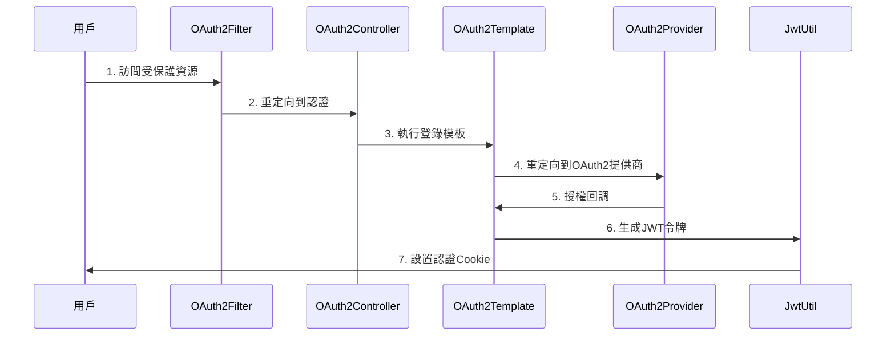
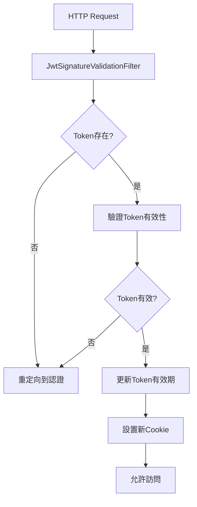

# CollaboPortal 項目共通部分設計書

## 📋 文檔信息

- **項目名稱**: CollaboPortal Common 模塊
- **版本**: SNAPSHOT-1.0.0  
- **技術棧**: Java 17 + Spring Boot 3.x + Maven
- **設計日期**: 2024年
- **文檔類型**: 系統設計書

---

## 🎯 1. 項目概述

### 1.1 設計目標

CollaboPortal Common模塊作為整個項目的核心基礎設施，提供統一的：
- **認證與授權框架** - 支援多OAuth2提供商的統一認證
- **配置管理系統** - 靈活的配置管理和環境適配
- **過濾器架構** - 可插拔的請求攔截和處理機制  
- **異常處理體系** - 統一的錯誤處理和響應格式
- **工具類庫** - 通用的功能組件和實用工具

### 1.2 架構原則

- **模組化設計** - 按功能職責劃分為獨立模塊
- **可擴展性** - 支援新功能的靈活擴展
- **可維護性** - 清晰的代碼結構和文檔
- **高內聚低耦合** - 模塊間依賴關係清晰
- **設計模式應用** - 大量運用GOF設計模式

---

## 🏗️ 2. 整體架構設計

### 2.1 模塊結構圖

```
common-parent (POM)
├── common-dependencies     # 依賴管理
├── common-bom             # BOM依賴管理  
├── common-component       # 核心組件
├── common-starter         # Spring Boot自動配置
│   ├── common-spring-boot-autoconfig
│   └── common-spring-boot-starter
└── common-plugins         # 插件模塊
    ├── common-jwt         # JWT認證插件
    └── common-oauth2      # OAuth2認證插件
```

### 2.2 技術棧詳情

| 技術組件 | 版本 | 用途 |
|---------|------|------|
| Java | 17 | 核心開發語言 |
| Spring Boot | 3.1.0 | 應用框架 |
| Spring Security | 6.x | 安全框架 |
| JWT (JJWT) | 0.11.5 | 令牌管理 |
| Jackson | 2.13.4.1 | JSON處理 |
| MyBatis | 3.5.13 | 持久層框架 |
| Lombok | 1.18.30 | 代碼簡化 |
| SLF4J + Logback | 2.0.7 | 日誌管理 |

---

## 🧩 3. 核心模塊設計

### 3.1 common-component 核心組件

#### 3.1.1 配置管理架構

**ConfigManager 單例模式**
```java
public class ConfigManager {
    private static final Map<Class<? extends BaseConfig>, BaseConfig> configMap = new ConcurrentHashMap<>();
    
    public static <T extends BaseConfig> T getConfig(Class<T> configClass) {
        // 雙重檢查鎖定的單例實現
        // 支援多種配置類型的統一管理
    }
}
```

**配置架構特點:**
- **工廠模式**: `CommonConfigFactory` 負責配置對象創建
- **策略模式**: 支援不同環境的配置策略
- **模板模式**: `BaseConfig` 介面定義配置類規範
- **線程安全**: 使用 `ConcurrentHashMap` 保證並發安全

#### 3.1.2 過濾器體系架構

**通用過濾器介面設計**
```java
public interface CommonFilter {
    // 路由配置
    CommonFilter addInclude(String... paths);
    CommonFilter addExclude(String... paths);
    
    // 鉤子函數
    CommonFilter setAuth(AuthFilterStrategyFunction auth);
    CommonFilter setError(AuthFilterErrorStrategyFunction error);
    CommonFilter setBeforeAuth(AuthFilterStrategyFunction beforeAuth);
}
```

**過濾器執行鏈:**
1. `LogTraceIdFilter` (Order: 1) - 日誌跟蹤
2. `MaintenanceModeFilter` - 維護模式控制
3. `OAuth2ProviderSelectionFilter` (Order: HIGHEST_PRECEDENCE) - OAuth2提供商選擇
4. `JwtSignatureValidationFilter` (Order: HIGHEST_PRECEDENCE + 1) - JWT驗證

#### 3.1.3 異常處理體系

**統一異常處理架構**
```java
@RestControllerAdvice
public class RestExceptionHandler {
    @ExceptionHandler(CommonException.class)
    public ErrorResponseBody handleCommonException(CommonException e);
    
    @ExceptionHandler(ForbiddenException.class) 
    public ErrorResponseBody handleForbiddenException(ForbiddenException e);
}
```

**異常類型層次:**
- `CommonException` - 業務異常基類
- `ForbiddenException` - 權限異常
- `InternalErrorCode` - 內部錯誤碼枚舉

#### 3.1.4 策略模式應用

**安全配置策略**
```java
@FunctionalInterface
public interface SecurityConfigStrategy {
    void configure(HttpSecurity http) throws Exception;
}

// 實現類
- AuthorizationStrategy     # 認證授權策略
- ExceptionHandlingStrategy # 異常處理策略  
- CsrfStrategy             # CSRF防護策略
- StatelessSessionStrategy  # 無狀態會話策略
```

### 3.2 common-plugins 插件架構

#### 3.2.1 OAuth2認證插件 (common-oauth2)

**模板方法模式實現**
```java
public abstract class OAuth2LoginTemplate {
    // 模板方法 - 定義標準流程
    public final void executeLogin(OAuth2ProviderContext context);
    public final void executeCallback(OAuth2ProviderContext context, String code, String state);
    
    // 抽象方法 - 子類實現
    protected abstract String buildAuthorizationUrl(...);
    protected abstract String exchangeCodeForToken(...);
    protected abstract Object fetchUserInfo(...);
    protected abstract String generateJwtToken(...);
}
```

**責任鏈模式應用**
```java
public class OAuth2CallbackChain {
    private final List<OAuth2CallbackHandler> handlers = new ArrayList<>();
    
    // 處理器鏈
    - StateValidationHandler          # 狀態驗證
    - AuthorizationCodeValidationHandler # 授權碼驗證  
    - ProviderConfigValidationHandler    # 提供商配置驗證
}
```

**工廠模式應用**
```java
@Component
public class OAuth2ClientRegistrationFactory {
    // 創建和管理多個OAuth2ClientRegistration實例
    // 支援配置驅動的提供商管理
}
```

**策略組合器模式**
```java
public class OAuth2ProviderSelectionStrategyComposer {
    // 策略鏈: 參數策略 > 路徑策略 > 域名策略
    - ParamBasedProviderSelectionStrategy
    - PathBasedProviderSelectionStrategy  
    - DomainBasedProviderSelectionStrategy
}
```

#### 3.2.2 JWT認證插件 (common-jwt)

**JWT處理架構**
```java
@Component
public class JwtTokenUtil {
    // JWT令牌生成
    public String generateTokenForMr(UserMaster userMaster);
    
    // JWT令牌驗證
    public Boolean isTokenExpired(String token);
    
    // JWT令牌更新
    public String updateExpiresAuthToken(String token);
}
```

**責任鏈驗證**
```java
public class JwtValidationChain {
    // 驗證處理器鏈
    - rParamHandler          # r參數處理
    - cookieCheckHandler     # Cookie檢查
    - tokenValidationHandler # 令牌驗證
}
```

**策略註冊表**
```java
public class JwtTokenStrategyRegistry {
    // 令牌提取策略
    - "header" -> JwtValidationUtils::extractTokenFromHeader
    - "cookie" -> JwtValidationUtils::extractTokenFromCookie
}
```

---

## 🎨 4. 設計模式應用詳解

### 4.1 創建型模式

#### 4.1.1 單例模式 (Singleton)
- **ConfigManager**: 全局配置管理器
- **JwtManager**: JWT管理器，使用雙重檢查鎖定

#### 4.1.2 工廠模式 (Factory)
- **CommonConfigFactory**: 配置對象工廠
- **OAuth2ClientRegistrationFactory**: OAuth2客戶端註冊工廠

#### 4.1.3 建造者模式 (Builder)
- **OAuth2ClientRegistration.Builder**: 複雜OAuth2配置構建
- **OAuth2ProviderContext.Builder**: 上下文對象構建

### 4.2 結構型模式

#### 4.2.1 組合模式 (Composite)
- **OAuth2ProviderSelectionStrategyComposer**: 策略組合器

#### 4.2.2 適配器模式 (Adapter)
- **AbstractMasterLoader**: 數據加載適配器

### 4.3 行為型模式

#### 4.3.1 策略模式 (Strategy)
- **SecurityConfigStrategy**: 安全配置策略
- **LoginStrategy**: 登錄策略
- **OAuth2ProviderSelectionStrategy**: OAuth2提供商選擇策略

#### 4.3.2 模板方法模式 (Template Method)
- **OAuth2LoginTemplate**: OAuth2登錄流程模板

#### 4.3.3 責任鏈模式 (Chain of Responsibility)
- **OAuth2CallbackChain**: OAuth2回調處理鏈
- **JwtValidationChain**: JWT驗證處理鏈

#### 4.3.4 觀察者模式 (Observer)
- **LogAOP**: AOP日誌切面，方法執行觀察

---

## 🔧 5. 核心功能實現

### 5.1 認證授權流程

#### 5.1.1 OAuth2認證流程


#### 5.1.2 JWT驗證流程


### 5.2 配置管理機制

#### 5.2.1 配置加載流程
```java
// 1. 讀取配置文件
Properties props = loadPropertiesFromFile(configPath);

// 2. 環境變量替換
String resolvedValue = resolveEnvironmentVariables(value);

// 3. 反射注入配置
Field field = configClass.getDeclaredField(fieldName);
field.setAccessible(true);
field.set(configObject, resolvedValue);
```

#### 5.2.2 多環境配置策略
- **application-common.properties**: 基礎配置
- **環境變量覆蓋**: `${ENV_VAR}` 語法支援
- **運行時配置更新**: ConfigManager動態管理

### 5.3 日誌跟蹤機制

#### 5.3.1 MDC上下文管理
```java
public class LogTraceIdFilter implements Filter {
    public void doFilter(ServletRequest request, ServletResponse response, FilterChain chain) {
        String traceId = UUID.randomUUID().toString();
        String ipAddress = getClientIpAddress(request);
        String trackingCookie = getOrCreateTrackingCookie(request, response);
        
        MDC.put("X-Track", traceId);
        MDC.put("ipAddress", ipAddress);  
        MDC.put("trackingCookieValue", trackingCookie);
        
        try {
            chain.doFilter(request, response);
        } finally {
            MDC.clear();
        }
    }
}
```

#### 5.3.2 AOP方法級日誌
```java
@Aspect
public class LogAOP {
    @Before("service() || controller() || repository()")
    public void startLog(JoinPoint jp) {
        logger.trace("===== START: " + jp.getSignature() + " =====");
    }
    
    @AfterReturning("service() || controller() || repository()")
    public void endSuccessLog(JoinPoint jp) {
        logger.trace("===== END SUCCESS: " + jp.getSignature() + " =====");
    }
}
```

---

## 📊 6. 性能與可擴展性設計

### 6.1 性能優化策略

#### 6.1.1 緩存機制
- **ConfigManager**: ConcurrentHashMap配置緩存
- **OAuth2ClientRegistrationFactory**: 客戶端註冊緩存
- **JwtTokenUtil**: 令牌驗證結果緩存

#### 6.1.2 線程安全保證
- **雙重檢查鎖定**: ConfigManager單例實現
- **ConcurrentHashMap**: 並發安全的緩存容器
- **volatile關鍵字**: 確保可見性

#### 6.1.3 資源管理
- **ConnectionPool**: 數據庫連接池配置
- **RestTemplate**: HTTP連接池配置
- **MDC清理**: 防止內存洩漏

### 6.2 可擴展性設計

#### 6.2.1 插件化架構
```java
// 新增OAuth2提供商
@Component
public class CustomOAuth2Provider implements OAuth2ProviderSelectionStrategy {
    @Override
    public String selectProvider(OAuth2ProviderContext context) {
        // 自定義提供商選擇邏輯
    }
}
```

#### 6.2.2 策略擴展機制
```java
// 新增安全策略
@Component  
public class CustomSecurityStrategy implements SecurityConfigStrategy {
    @Override
    public void configure(HttpSecurity http) throws Exception {
        // 自定義安全配置
    }
}
```

#### 6.2.3 過濾器擴展
```java
// 新增自定義過濾器
@Component
public class CustomFilter implements Filter {
    @Override
    public void doFilter(ServletRequest request, ServletResponse response, FilterChain chain) {
        // 自定義過濾邏輯
    }
}
```

---

## 🛡️ 7. 安全性設計

### 7.1 認證安全

#### 7.1.1 OAuth2安全措施
- **State參數**: 防止CSRF攻擊
- **PKCE支援**: 增強安全性（可擴展）
- **Scope限制**: 最小權限原則
- **SSL/TLS**: 強制HTTPS通信

#### 7.1.2 JWT安全實現
- **HMAC-SHA256**: 強簽名算法
- **短期有效期**: 降低洩漏風險
- **自動刷新**: 無感知令牌更新
- **HttpOnly Cookie**: 防止XSS攻擊

### 7.2 數據安全

#### 7.2.1 敏感信息保護
- **配置加密**: 敏感配置項加密存儲
- **日誌脫敏**: 敏感信息不記錄到日誌
- **內存清理**: 及時清理敏感數據

#### 7.2.2 訪問控制
- **路徑級權限**: 細粒度URL權限控制
- **角色映射**: 靈活的角色權限體系
- **動態權限**: 支援運行時權限變更

---

## 📈 8. 監控與維護

### 8.1 監控指標

#### 8.1.1 系統監控
- **認證成功率**: OAuth2/JWT認證成功比例
- **請求響應時間**: 各過濾器執行時間
- **錯誤率統計**: 異常類型和頻率分析
- **緩存命中率**: 配置和令牌緩存效果

#### 8.1.2 業務監控  
- **用戶活躍度**: 認證用戶數量和行為
- **API調用統計**: 各端點調用頻率
- **安全事件**: 異常認證嘗試記錄

### 8.2 維護策略

#### 8.2.1 日誌管理
- **分級記錄**: ERROR/WARN/INFO/DEBUG/TRACE
- **結構化日誌**: JSON格式便於分析
- **日誌輪轉**: 防止磁盤空間耗盡
- **集中收集**: ELK Stack集成

#### 8.2.2 配置管理
- **版本控制**: 配置變更歷史跟蹤
- **環境隔離**: 開發/測試/生產環境分離
- **熱更新**: 支援運行時配置更新（部分）

---

## 🔄 9. 未來規劃與擴展

### 9.1 短期優化 (3個月內)

1. **性能優化**
   - 引入Redis緩存提升配置查詢性能
   - 優化JWT令牌驗證邏輯
   - 增加連接池監控

2. **功能增強**
   - 支援更多OAuth2提供商
   - 增加2FA雙因子認證
   - 完善審計日誌功能

### 9.2 中期規劃 (6個月內)

1. **微服務化**
   - 認證服務獨立部署
   - 配置中心服務化
   - 服務發現與註冊

2. **安全加強**
   - 引入OAuth2 PKCE
   - 實現細粒度權限控制
   - 增加行為分析和異常檢測

### 9.3 長期願景 (1年內)

1. **雲原生改造**
   - Kubernetes部署支援
   - 服務網格集成
   - 彈性伸縮能力

2. **智能化運維**
   - 自動故障恢復
   - 智能監控告警
   - 性能自動調優

---

## 📚 10. 開發指南

### 10.1 新功能開發流程

1. **需求分析** → 確定功能範圍和接口設計
2. **設計評審** → 架構設計和技術方案評審  
3. **編碼實現** → 遵循現有設計模式和代碼規範
4. **單元測試** → 確保代碼質量和覆蓋率
5. **集成測試** → 驗證與現有系統的集成
6. **文檔更新** → 更新設計文檔和API文檔

### 10.2 代碼規範

#### 10.2.1 命名約定
- **類名**: PascalCase，體現職責（如 `OAuth2LoginTemplate`）
- **方法名**: camelCase，動詞開頭（如 `executeLogin`）
- **常量**: UPPER_SNAKE_CASE（如 `JWT_TOKEN_VALIDATION`）
- **包名**: 小寫，按功能模塊劃分

#### 10.2.2 設計原則
- **單一職責**: 每個類只負責一個功能
- **開閉原則**: 對擴展開放，對修改關閉
- **依賴倒置**: 依賴抽象而非具體實現
- **接口隔離**: 接口設計精簡且專一

### 10.3 測試策略

#### 10.3.1 測試分層
- **單元測試**: 覆蓋核心業務邏輯
- **集成測試**: 驗證模塊間協作
- **端到端測試**: 完整認證流程測試
- **性能測試**: 高並發場景驗證

#### 10.3.2 測試工具
- **JUnit 5**: 單元測試框架
- **Mockito**: Mock對象創建
- **TestContainers**: 集成測試環境
- **JMeter**: 性能測試工具

---

## 📖 11. 總結

CollaboPortal Common模塊作為整個項目的基礎設施，通過精心的架構設計和豐富的設計模式應用，提供了：

### 11.1 核心價值

1. **統一認證授權**: 多OAuth2提供商支援，靈活的JWT管理
2. **可插拔架構**: 過濾器、策略、處理器均可靈活擴展
3. **完善監控**: 全鏈路日誌跟蹤，詳細的性能監控
4. **高可維護性**: 清晰的模塊劃分，豐富的設計模式應用

### 11.2 技術亮點

- **15+設計模式**: 經典設計模式的實際應用
- **響應式架構**: 支援高並發和彈性擴展
- **安全優先**: 多層次的安全防護機制
- **雲原生就緒**: 面向微服務和容器化的設計

### 11.3 持續改進

該架構將持續演進，緊跟技術發展趨勢，為業務發展提供強有力的技術支撐。通過模塊化設計和豐富的擴展點，能夠快速響應業務需求變化，保持技術競爭力。

---

*本設計書將隨著項目發展持續更新，確保文檔與代碼實現的一致性。* 