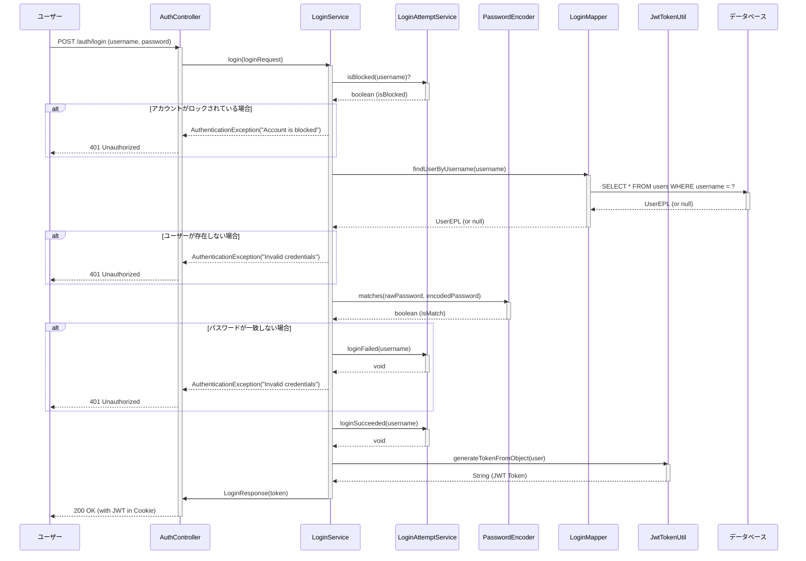

```markdown
# Common モジュール 実装仕様書

## 1. 概要

`common` モジュールは、プロジェクト全体で共通して利用される機能を提供するライブラリです。認証、認可、ロギング、設定管理、例外処理など、アプリケーションの基盤となる機能を集約しています。

## 2. 主要機能

### 2.1. 認証・認可 (Authentication & Authorization)

- **JWT (JSON Web Token) ベースの認証:**
    - `common-jwt` モジュールがJWTの生成、解析、検証を担当します。
    - `JwtTokenUtil` クラスが中心となり、トークン操作のユーティリティメソッドを提供します。
- **OAuth 2.0 連携:**
    - `common-oauth2` モジュールがOAuth 2.0プロバイダーとの連携をサポートします。
    - `OAuth2LoginTemplate` とそのサブクラスが、OAuth 2.0のログインフローを抽象化し、プロバイダーごとの差異を吸収します。
- **柔軟な認証戦略:**
    - `AuthenticationStrategy` インターフェースと `AuthenticationStrategyRegistry` により、複数の認証方式（例：Cookieベース、ヘッダーベース）を動的に切り替えることが可能です。
- **ロールベースのアクセス制御 (RBAC):**
    - `@RequiresRole` アノテーションを使用することで、特定のエンドポイントに必要なロールを宣言的に指定できます。
    - `AuthorizationInterceptor` がリクエストをインターセプトし、ユーザーのロールに基づいてアクセスを検証します。

### 2.2. ロギング (Logging)

- **AOPによるログ出力:**
    - `LogAOP` クラスが、Controller、Service、Repositoryの各層でメソッドの実行開始、成功、失敗を自動的にログに記録します。
- **機密情報のマスキング:**
    - `SensitiveDataMaskingEncoder` と `SensitiveDataMaskingFilter` が連携し、ログに出力されるパスワード、メールアドレス、JWTトークンなどの機密情報を自動的にマスキングします。
    - マスキングルールは `log.masking.*` プロパティで詳細に設定可能です。
- **トレースIDの付与:**
    - `LogTraceIdFilter` が各リクエストにユニークなトレースIDを付与し、MDC (Mapped Diagnostic Context) を通じてログに出力します。これにより、特定のリクエストに関連するログの追跡が容易になります。

### 2.3. 設定管理 (Configuration Management)

- **階層的な設定:**
    - `common-parent` を頂点とするMavenのモジュール構造により、依存関係とプロパティが一元管理されています。
    - `common-dependencies` と `common-bom` (Bill of Materials) が、プロジェクト全体で使用されるライブラリのバージョンを統一します。
- **プロパティの自動読み込み:**
    - `CommonConfig` や `LogMaskConfig` などの設定クラスが、`application.properties` や環境変数から値を自動的に読み込みます。
    - `CommonConfigFactory` が設定オブジェクトの生成を管理します。
- **Spring Boot AutoConfiguration:**
    - `common-spring-boot-autoconfig` モジュールが、必要なBean（例：`JwtTokenUtil`, `WebSecurityConfig`）をSpring Bootアプリケーションの起動時に自動的に設定します。

### 2.4. 例外処理 (Exception Handling)

- **グローバル例外ハンドラ:**
    - `RestExceptionHandler` が、アプリケーション全体で発生した例外を捕捉し、統一された形式のエラーレスポンスを生成します。
    - `CommonException`, `ForbiddenException` などのカスタム例外クラスにより、ビジネスロジックに合わせた詳細なエラーハンドリングが可能です。
- **Spring Security 例外処理:**
    - `ExceptionHandlingStrategy` が、認証・認可プロセスで発生した例外（`AuthenticationException`, `AccessDeniedException`）を捕捉し、適切なHTTPステータスコードとエラーメッセージを返します。

### 2.5. Web関連

- **リクエスト/レスポンスの抽象化:**
    - `BaseRequest`, `BaseResponse` インターフェースにより、Servlet APIへの直接的な依存を減らし、コードの移植性とテスト容易性を向上させています。
- **CSRF対策とセッション管理:**
    - `CsrfStrategy` と `StatelessSessionStrategy` により、セキュリティ設定が標準化されています。デフォルトではCSRF保護は無効化され、ステートレスなセッション管理が行われます。

## 3. モジュール構成

- **`common-parent`**: 全ての`common`モジュールの親POM。依存関係とプラグインのバージョンを管理します。
- **`common-dependencies`**: プロジェクト全体で使用される外部ライブラリの依存関係を定義します。
- **`common-bom`**: `common`モジュール間の依存関係を管理するBill of Materialsです。
- **`common-component`**: コアとなる共通コンポーネント（POJO、ユーティリティ、例外クラスなど）を含みます。
- **`common-plugins`**: JWTやOAuth 2.0など、特定の機能を提供するプラグインモジュールを管理します。
    - **`common-jwt`**: JWT関連機能を提供します。
    - **`common-oauth2`**: OAuth 2.0関連機能を提供します。
- **`common-starter`**: Spring Bootの自動設定を提供します。
    - **`common-spring-boot-autoconfig`**: Spring Bootの自動設定クラスを含みます。
    - **`common-spring-boot-starter`**: `autoconfig`モジュールへの依存関係を提供し、アプリケーションが容易に`common`モジュールを利用できるようにします。
    - **`common-jakarta-servlet`**: Jakarta Servlet APIに準拠したリクエスト/レスポンスのラッパーを提供します。

## 4. 実装方法

### 4.1. 依存関係の追加

アプリケーションの `pom.xml` に `common-spring-boot-starter` への依存関係を追加します。

```xml
<dependency>
    <groupId>com.collaboportal</groupId>
    <artifactId>common-spring-boot-starter</artifactId>
    <version>${revision}</version>
</dependency>
```

### 4.2. 設定

`application.properties` または `application.yml` に、`common.*` や `log.masking.*` などのプロパティを設定します。環境変数を使用して値を上書きすることも可能です。

**例：**
```properties
# 認証を無効化（開発時）
common.util.noAuthorization=0

# ログマスキングを無効化
log.masking.enableLogMasking=false
```

### 4.3. アノテーションの利用

Controllerのメソッドに `@RequiresRole` アノテーションを追加して、アクセス制御を実装します。

```java
@RestController
public class MyController {

    @GetMapping("/admin/data")
    @RequiresRole("ADMIN")
    public ResponseEntity<String> getAdminData() {
        return ResponseEntity.ok("This is admin data.");
    }
}
```

## 5. 注意事項

- **環境変数:** 本番環境では、データベースのパスワードやJWTのシークレットキーなどの機密情報は、環境変数を通じて設定することが強く推奨されます。
- **ログレベル:** 本番環境では、パフォーマンスへの影響を考慮し、ログレベルを`INFO`以上に設定してください。`DEBUG`や`TRACE`レベルのログは、開発時やトラブルシューティング時にのみ有効にしてください。
- **キャッシュ:** `ConfigManager` は設定をキャッシュしますが、動的に設定を変更した場合は、アプリケーションの再起動が必要になることがあります。

## 6. 認証フロー詳解 (UML)

### 6.1. ユーザーログインフロー (User Login Flow)

このフローは、ユーザーがユーザー名とパスワードを使用してシステムにログインし、認証トークン（JWT）を取得するプロセスを示します。



### 6.2. APIリクエスト認証フロー (API Request Authentication Flow)

このフローは、クライアントがJWTを使用して保護されたAPIエンドポイントにアクセスする際の認証プロセスを示します。このプロセスは主に `AuthServletFilter` と `DatabaseAuthStrategy` によって処理されます。

```mermaid
sequenceDiagram
    participant Client as クライアント
    participant AuthServletFilter as AuthServletFilter
    participant DatabaseAuthStrategy as DatabaseAuthStrategy
    participant JwtTokenUtil as JwtTokenUtil
    participant Controller as Controller

    Client->>Controller: API Request (e.g., GET /api/data) with AuthToken Cookie
    activate Controller

    Note over AuthServletFilter: Servlet Container invokes the filter
    AuthServletFilter->>AuthServletFilter: doFilter(request, response, chain)
    activate AuthServletFilter

    AuthServletFilter->>AuthServletFilter: isRequestNeedAuth(path)?
    alt 認証が不要なパスの場合
        AuthServletFilter->>Controller: chain.doFilter(...)
        deactivate AuthServletFilter
    end

    Note over AuthServletFilter: beforeAuthStrategy.authenticate() を実行 (設定されている場合)

    AuthServletFilter->>DatabaseAuthStrategy: authenticate(request, response)
    activate DatabaseAuthStrategy

    DatabaseAuthStrategy->>BaseRequest: getCookieValue("AuthToken")
    DatabaseAuthStrategy-->>DatabaseAuthStrategy: String (token or null)

    alt トークンが存在しない場合
        DatabaseAuthStrategy->>BaseResponse: redirect("/login.html")
        DatabaseAuthStrategy-->>AuthServletFilter: RedirectException
        deactivate DatabaseAuthStrategy
        AuthServletFilter-->>Client: 302 Redirect to /login.html
        deactivate AuthServletFilter
        deactivate Controller
    end

    DatabaseAuthStrategy->>JwtTokenUtil: isTokenExpired(token)?
    activate JwtTokenUtil
    JwtTokenUtil-->>DatabaseAuthStrategy: boolean (isExpired)
    deactivate JwtTokenUtil

    alt トークンが期限切れの場合
        DatabaseAuthStrategy->>BaseResponse: redirect("/login.html")
        DatabaseAuthStrategy-->>AuthServletFilter: RedirectException
        deactivate DatabaseAuthStrategy
        AuthServletFilter-->>Client: 302 Redirect to /login.html
        deactivate AuthServletFilter
        deactivate Controller
    end

    DatabaseAuthStrategy->>JwtTokenUtil: getItemsJwtToken(token)
    activate JwtTokenUtil
    JwtTokenUtil-->>DatabaseAuthStrategy: Map<String, String> (userInfo)
    deactivate JwtTokenUtil

    DatabaseAuthStrategy->>CommonHolder: getStorage().set("USER_INFO", userInfo)

    DatabaseAuthStrategy->>JwtTokenUtil: updateExpiresAuthToken(token)
    activate JwtTokenUtil
    JwtTokenUtil-->>DatabaseAuthStrategy: String (refreshedToken)
    deactivate JwtTokenUtil

    DatabaseAuthStrategy->>BaseResponse: addCookie("AuthToken", refreshedToken)
    deactivate DatabaseAuthStrategy

    AuthServletFilter->>Controller: chain.doFilter(request, response)
    deactivate AuthServletFilter

    Note over Controller: Controller method executes

    Controller-->>Client: 200 OK (with API data)
    deactivate Controller
```
```